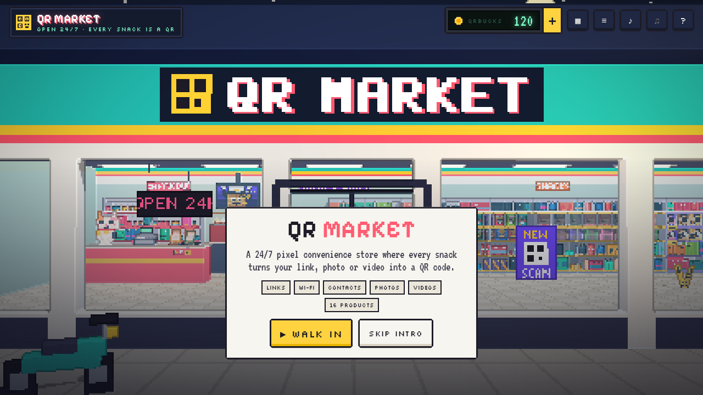

# QR Market

A 24/7 pixel-art convenience store in 3D where every product on the shelf turns your link, photo or video into a QR code — each with its own unboxing.

Walk in from the street, browse the aisles side-scroller style, pick a product and watch it make your code: pour a box of **Captain QR** cereal and the cocoa squares swim into a QR in the milk, rip a pack of **Pixel Drops** and the candies bounce, roll around and hop into a rainbow QR. Tap **Scan mode** and the camera snaps straight on so your phone can read it — the app even decodes the rendered 3D frame to prove it scans.



## Features

- **A walkable 3D pixel store.** Low-res rendering with crisp depth/normal outlines, voxel props, hand-drawn pixel textures and a bitmap font. Eight aisles: checkout (with a waving cat cashier and an ad TV), photo & video, snacks, cereal, fresh & hot, a glass-door cooler, a chest freezer and a velvet-roped premium shelf. There is a store cat. You can pet it.
- **16 products, 60 templates.** Every product has its own reveal animation and 3–4 flavors (colorways). See the list below.
- **Every kind of QR content.** Links (with YouTube / TikTok / LINE / Maps detection), plain text, Wi-Fi logins, contact cards (vCard), photos and videos.
- **Pixel Postcards & Flipbooks — the QR carries the picture.** A photo is squeezed into a 12–40 px pixel picture (or a video into a few looping frames), palette-quantised, bit-packed, deflated and stored in the link's `#fragment`. Scanning opens the built-in viewer, which decodes it instantly. Nothing is uploaded anywhere.
- **Scannability you can trust.** Finder and alignment patterns always stay square, scan mode switches pieces to scan-safe colours, and every poster and scan-mode frame is checked with jsQR in the UI (“✓ Poster scans · ✓ 3D view scans”).
- **Take it home.** Download a pixel-art poster PNG (the product artwork with your code), a plain PNG, or an SVG for print; copy the image or the encoded text.
- **QRBucks.** A wallet with a daily bonus, rewarded ads at the checkout TV, packs, a Market Pass, and premium products in the cooler, freezer, counter and VIP shelf you can preview before unlocking. Payments run in demo mode by default (see below).
- **Chiptune everything.** Door chime, rips, clacks, fizz, cash register and an optional store music loop, all synthesised with WebAudio.
- Works on phones: touch to walk and orbit, bottom-sheet editor.

## Products

16 products, 60 flavors. Free products are open to everyone; premium ones can be previewed and are unlocked with QRBucks.

| Product | Aisle | Price | Reveal |
| --- | --- | --- | --- |
| Captain QR | Cereal | Free | Pour the box. Every cocoa square swims into place in the milk, and Captain QR salutes. |
| Pixel Drops | Snacks | Free | Rip the pack. Candies bounce, roll around and hop into a rainbow QR. |
| Choco Block | Snacks | Free | Slide off the sleeve, unfold the foil: dark and white chocolate squares pop up to spell your code. |
| Dough-R Code | Snacks | Free | Flip the lid: glazed donut holes pop out, bounce around and roll into place. |
| Crunch Bytes | Snacks | Free | The bag puffs up and pops. Chips rain down and hop into your code. |
| Onigiri QR | Fresh & Hot | Free | Pull the tabs 1-2-3: the wrapper slides off and the nori wraps on as your code. |
| Pixel Postcard | Photo & Video | Free | Flash! The photo slides out and develops, with your code printed beside the picture. |
| Flipbook Tape | Photo & Video | Free | Insert the tape: your flipbook plays on a tiny TV, then the screen turns into your code. |
| Lucky Scratch | Checkout | 50 QB | Scratch the silver foil with your finger or mouse to reveal the code. |
| Latte Code | Fresh & Hot | 60 QB | Milk foams up, a stencil drops on and cocoa dusts your code onto the latte. |
| Fizz Pop | Cold Drinks | 80 QB | Crack the can: a bubble geyser floats up and freezes into an ice-cold QR wall. |
| Frosty Cubes | Frozen | 90 QB | Tear the ice bag: cubes clatter across the frosty tray and skate into place. |
| Boba Bliss | Cold Drinks | 100 QB | Shake the cup, stab the seal: tapioca pearls pour out and roll into your code. |
| QR Gacha | Checkout | 120 QB | Drop a coin, turn the crank: a capsule pops out with a random rare finish. |
| Volt Energy | Cold Drinks | 150 QB | Crack it open: lightning crackles, then a neon hologram QR flickers to life. |
| Golden Ticket | Premium | 200 QB | Peel back the golden foil: a ticket rises, spins and lands with your code embossed in gold. |

## Run it

```bash
npm install
npm run dev          # http://localhost:5173
npm test             # unit tests (QR encoding, payloads, postcard codec)
npm run test:e2e     # opens every product in headless Chromium and checks the 3D view + poster scan
node scripts/e2e.mjs --thorough   # every flavor at three code sizes
npm run build        # static site in dist/
```

Controls: drag, scroll or ← → to walk; click a product; in the showcase drag to orbit, right-drag to pan, scroll to zoom; Space opens the product; Esc goes back.

Dev helpers: `/?debug=art&p=<product-id>` shows every flavor's poster with a live scan check.

## Deploy

`.github/workflows/deploy.yml` builds and publishes to GitHub Pages on every push to `main`. Turn it on once under **Settings → Pages → Source: GitHub Actions**.

Pixel Postcard links point at the site that made them. The workflow sets `VITE_PUBLIC_URL` to your Pages URL; set it yourself when hosting elsewhere so postcards open on your domain.

## QRBucks, payments and ads

Everything lives in `src/app/config.ts`:

- **Payments** are in demo mode (`demoPayments: true`): buying a pack adds QRBucks for free and says so. To sell for real, create a Stripe Payment Link per pack, paste it into `paymentLink` and set `demoPayments` to `false`. The buy buttons then open Stripe Checkout. Crediting QRBucks after a real payment must be verified on a server (a Stripe webhook that records the purchase and returns a signed grant to the client); the browser-only wallet in `src/app/state.ts` is for demo play and can be edited by users.
- **Ads**: the checkout TV plays a built-in house ad with a countdown before paying out. Replace `showAd` in `src/ui/Shop.ts` with your ad network's rewarded-video SDK.
- Starting balance, daily bonus, ad reward and daily ad cap are plain numbers in the same file.

## How it's built

Vite + TypeScript + three.js, no UI framework.

```
src/engine     PixelRenderer (low-res + outlines + dissolve), voxel mesher, Painter + bitmap fonts,
               tweens, synth audio, geometry batcher
src/qr         QR encoder wrapper with module kinds, payload builders, postcard codec, export, jsQR scan
src/store      the store: layout, fixtures, props, filler merchandise, storefront, store cat
src/showcase   the demo counter where products perform, with orbit and scan-mode cameras
src/products   one folder per product + shared helpers (piece swarms, QR layout, props, posters)
src/ui         HUD, receipt panel, QRBucks shop, ads, toasts
src/viewer     landing page for scanned Pixel Postcards
```

### Adding a product

A product is a `ProductDef` (`src/products/types.ts`): a small shelf model, a `createShowcase()` that returns the reveal animation, and a `poster()`. Register it in `src/products/index.ts` and give it a spot in `src/store/Store.ts`. Rules that keep codes scannable:

1. Dark modules uniformly dark on a light surface, with at least two modules of quiet zone.
2. Finder and alignment modules must be solid squares — use `QRSwarm` with `struct` pieces when data pieces are round.
3. Implement `setScanMode()` to switch to scan-safe colours/sizes, then run `npm run test:e2e`.

## Credits

Fonts: [Pixelify Sans](https://fonts.google.com/specimen/Pixelify+Sans), [Silkscreen](https://fonts.google.com/specimen/Silkscreen) and [VT323](https://fonts.google.com/specimen/VT323) (SIL Open Font License, via Fontsource). Libraries: [three.js](https://threejs.org), [qrcode-generator](https://github.com/kazuhikoarase/qrcode-generator), [jsQR](https://github.com/cozmo/jsQR). "QR Code" is a registered trademark of DENSO WAVE INCORPORATED.
