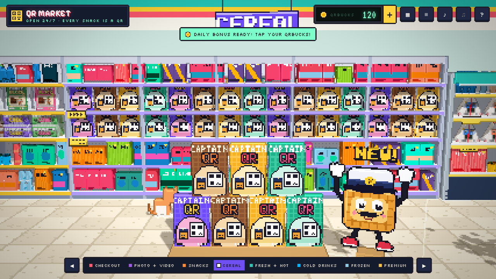
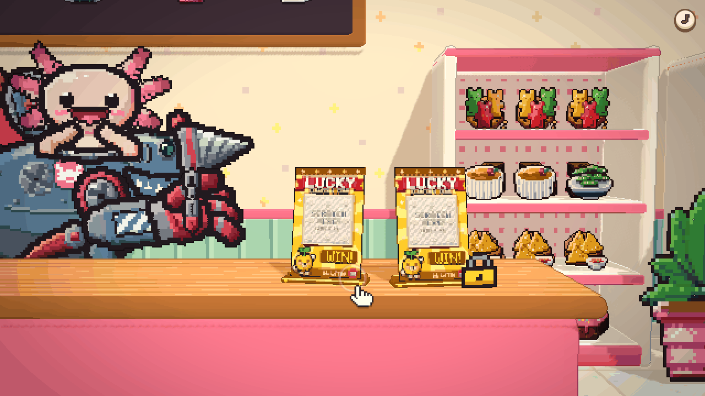
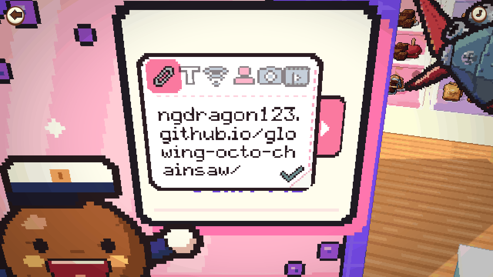
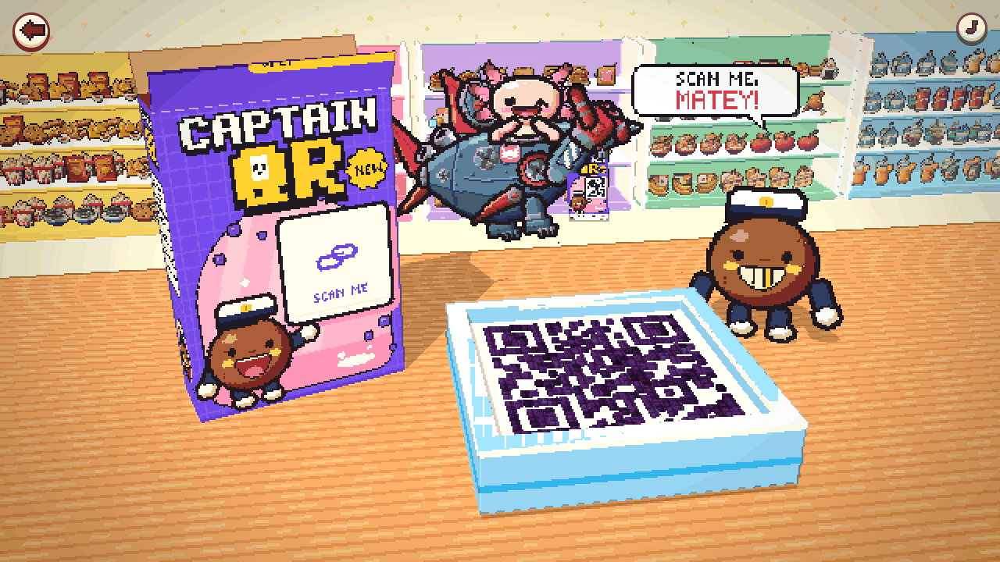

# Xolotl Kobini

A cosy 3D pixel-art convenience store, run by a pink axolotl who pilots a shark robot. Every snack on the shelf turns your link, photo or video into a QR code, each with its own unboxing.

There is almost no UI. Zoom into the shelves and pick things up yourself, type or paste your link onto the sticker on the package, pull the tab to rip it open, tap the finished code to scan it, and take the receipt the clerk prints for you.


| | |
| --- | --- |
|  |  |
|  |  |

## What's inside

- **A walkable 3D store in pixel art.** Rounded pastel fixtures, pendant lamps and bunting, lit by a finer pixel filter with crisp outlines. Nine aisles: checkout, bakery, snacks, candy, cereal, fresh and hot, a glass-door drinks cooler, frozen, and a photo corner.
- **Detailed pixel food everywhere.** Hundreds of hand-shaded food sprites (a procedural "chef" lights every shape from the top-left, bands it into a pixel-artist colour ramp and inks the outline). Tap any of them for a little boop.
- **Characters.** The clerk, an axolotl in a shark mech, floats behind the counter and reacts to you. Round, dot-eyed buddies shop the aisles, wave when you pass, and hop when you poke them. Every product has its own buddy mascot.
- **16 products.** Each has its own reveal, from pouring cereal to cracking a soda to scratching a lottery card. See the list below.
- **The package is the editor.** The sticker on each unopened package has mode icons for link, text, Wi-Fi, contact, photo and video. Your text appears on it in pixel letters as you type. An invisible text box sits over it, so typing, pasting and phone keyboards all work normally.
- **Pixel Postcards and Flipbooks.** A photo is squeezed into a tiny pixel picture (or a video into a few looping frames) that lives inside the link itself. Scanning opens the built-in viewer. Nothing is uploaded anywhere.
- **Scannable by design.** Finder patterns stay square, scan mode switches pieces to scan-safe colours and fogs the background, and every code is checked by decoding the rendered 3D frame and the exported poster.
- **Unlocking packs.** Tap a locked pack and a pay screen opens right there. You can buy that pack, take the monthly Member Pass (every pack), or watch a short ad to try it today. Payments are demo-only by default (see below).
- **Sound.** Door chime, boops, rips, fizz, a cash register, mech servos and a receipt printer, all synthesised with WebAudio.
- **Phones.** Drag to walk and orbit, pinch to zoom, tap to pick things up.

## Products

| Product | Aisle | Price | Reveal |
| --- | --- | --- | --- |
| Captain QR | Cereal | Free | Pour the box. Every cocoa square swims into place in the milk. |
| Pixel Drops | Snacks | Free | Rip the pack. Candies bounce, roll around and hop into a rainbow QR. |
| Choco Block | Candy | Free | Slide off the sleeve, unfold the foil: chocolate squares pop up to spell your code. |
| Dough-R Code | Bakery | Free | Flip the lid: glazed donut holes pop out, bounce around and roll into place. |
| Crunch Bytes | Snacks | Free | The bag puffs up and pops. Chips rain down and hop into your code. |
| Onigiri QR | Fresh | Free | Pull the tabs 1-2-3: the wrapper slides off and the nori wraps on as your code. |
| Pixel Postcard | Photo corner | Free | Flash! The photo slides out and develops, with your code printed beside it. |
| Flipbook Tape | Photo corner | Free | Insert the tape: your flipbook plays on a tiny TV, then the screen turns into your code. |
| Lucky Scratch | Checkout | $0.99 | Scratch the silver foil with your finger or mouse to reveal the code. |
| Latte Code | Coffee bar | $0.99 | Milk foams up, a stencil drops on and cocoa dusts your code onto the latte. |
| Fizz Pop | Drinks | $1.49 | Crack the can: a bubble geyser floats up and freezes into an ice-cold QR wall. |
| Frosty Cubes | Frozen | $1.49 | Tear the ice bag: cubes clatter across the frosty tray and skate into place. |
| Boba Bliss | Drinks | $1.49 | Shake the cup, stab the seal: tapioca pearls pour out and roll into your code. |
| QR Gacha | Checkout | $1.99 | Drop a coin, turn the crank: a capsule pops out with a random rare finish. |
| Volt Energy | Drinks | $1.99 | Crack it open: lightning crackles, then a neon hologram QR flickers to life. |
| Golden Ticket | Checkout | $2.99 | Peel back the golden foil: a ticket rises, spins and lands with your code embossed in gold. |

## Run it

```bash
npm install
npm run dev          # http://localhost:5173
npm test             # unit tests (QR encoding, payloads, postcard codec, unlocks)
npm run test:e2e     # opens every product in headless Chromium and checks the 3D view + poster scan
node scripts/e2e.mjs --thorough   # extra code sizes
npm run build        # static site in dist/
```

Controls: drag, arrow keys or a sideways swipe walk the aisle. Scroll or pinch zooms toward the pointer, drag pans while zoomed, and double-tap zooms in and out. Tap a pack to pick it up. At the counter, drag orbits the camera and scroll zooms. Space opens the pack, Esc goes back.

Dev galleries: `/?debug=food` (food sprites), `/?debug=buddy` (mascots), `/?debug=scene&s=clerk` (the clerk, animated), `/?debug=scene&s=buddies`, `/?debug=art&p=<product-id>` (packaging and posters with a live scan check).

## Deploy

`.github/workflows/deploy.yml` builds and publishes to GitHub Pages on every push to `main`. Turn it on once under **Settings → Pages → Source: GitHub Actions**.

Pixel Postcard links point at the site that made them. The workflow sets `VITE_PUBLIC_URL` to your Pages URL. Set it yourself when hosting elsewhere so postcards open on your domain.

`npm run build:single` bundles everything into one HTML file (`dist-single/index.html`) for embedded previews. Its postcard links come from `.env.single`. When the page runs inside another page, where page-started downloads are blocked, saving uses the host's save prompt if it offers one, or shows the picture to save by hand.

### itch.io

`docs/itch/` has an itch.io kit: `cover.gif` (630×500 animated cover: the storefront with shoppers walking by), `banner.gif` (960×240, five mascots dancing) and `xolotl-kobini-itch.zip` (the single-file build as `index.html`). On itch, create an HTML project, upload the zip, tick "This file will be played in the browser", and set the embed size to something like 960×600 with the fullscreen button on. Rebuild the zip after changes with `npm run build:single` and zip `dist-single/index.html`.

## Payments, the Member Pass and ads

Everything lives in `src/app/config.ts`:

- **Payments** run in demo mode (`demoPayments: true`). Buy and Member Pass unlock for free, and the pay screen says so. To sell for real, create a Stripe Payment Link per pack and a subscription Payment Link for the Member Pass, paste them into `paymentLinks` / `member.paymentLink`, and set `demoPayments` to `false`; the buttons then open Stripe Checkout. Unlocking after a real payment must be verified on a server, with a Stripe webhook that records the purchase and returns a signed grant to the client. The browser-only save in `src/app/state.ts` is for demo play and can be edited by users.
- **Ads**: "Watch ad" plays a built-in store promo with a countdown, then unlocks that pack for the rest of the day. Replace `showAd` in `src/ui/PayScreen.ts` with your ad network's rewarded-video SDK.
- Pack prices and the pass price are plain strings in the same file.

## How it's built

Vite + TypeScript + three.js, no UI framework.

```
src/art        pixel toolkit: masks and ramps, the food "chef", exact-silhouette sprite meshes,
               buddy mascots (portraits + animated rigs), the clerk, icons, sprite particles, logo
src/engine     PixelRenderer (low-res render + outlines + iris wipe), tweens, synth audio, batching
src/qr         QR encoder wrapper, payload builders, postcard codec, export, jsQR scan
src/store      the store: layout, rounded fixtures, instanced food stock, shoppers, storefront
src/showcase   the checkout counter stage with orbit and scan-mode cameras
src/products   one folder per product + shared helpers (piece swarms, QR layout, posters)
src/app        game flow, the package sticker editor, unlocks and config
src/ui         the few DOM bits: pay screen, save dialog, hints, toasts, styles
src/viewer     landing page for scanned Pixel Postcards
```

### Adding a product

A product is a `ProductDef` (`src/products/types.ts`): a small shelf model, a `createShowcase()` that returns the reveal animation, and a `poster()`. Register it in `src/products/index.ts` and give it a spot in `src/store/Store.ts`. Give the showcase a `label` anchor so the link sticker sits nicely on the package. Rules that keep codes scannable:

1. Dark modules uniformly dark on a light surface, with at least two modules of quiet zone.
2. Finder and alignment modules must be solid squares. Use `QRSwarm` with `struct` pieces when data pieces are round.
3. Implement `setScanMode()` to switch to scan-safe colours and sizes, then run `npm run test:e2e`.

## Credits

Fonts: [Pixelify Sans](https://fonts.google.com/specimen/Pixelify+Sans), [Silkscreen](https://fonts.google.com/specimen/Silkscreen) and [VT323](https://fonts.google.com/specimen/VT323) (SIL Open Font License, via Fontsource). Libraries: [three.js](https://threejs.org), [qrcode-generator](https://github.com/kazuhikoarase/qrcode-generator), [jsQR](https://github.com/cozmo/jsQR). "QR Code" is a registered trademark of DENSO WAVE INCORPORATED.
